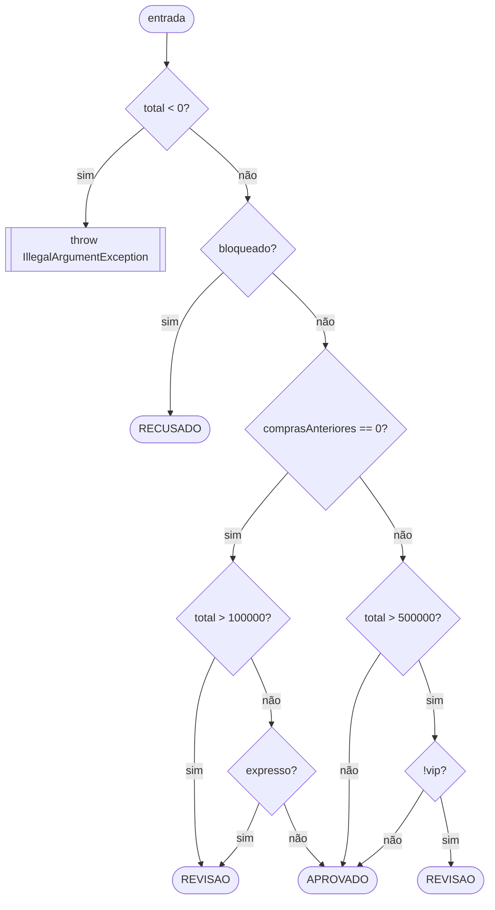
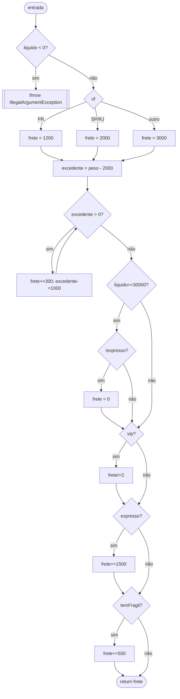
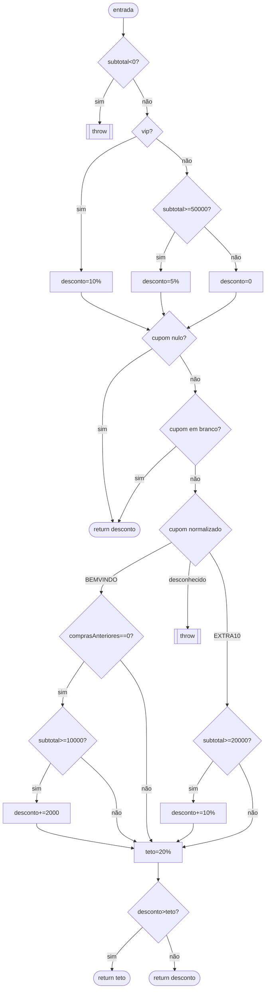
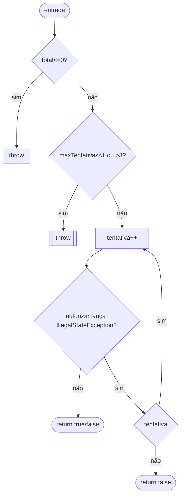
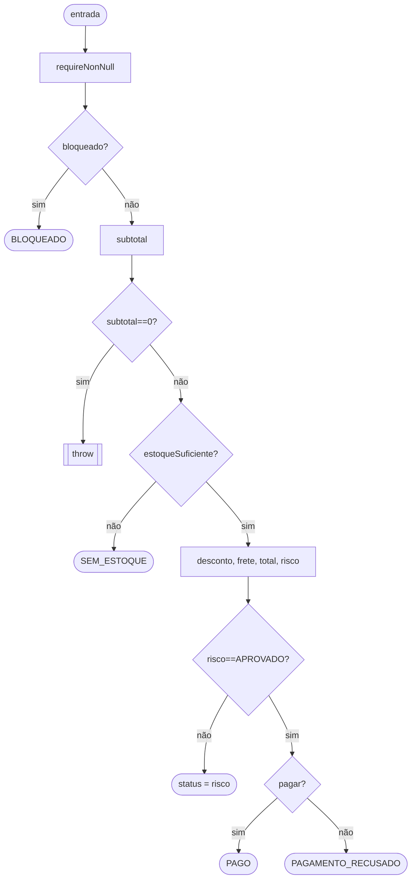

# Relatório — Central de Pedidos

## 1. Relacionamento entre classes e grafo de chamadas de `fechar`

`PedidoService.fechar(Pedido, Cliente)` orquestra, nesta ordem fixa:

```
PedidoService.fechar
 ├─ Objects.requireNonNull(pedido), Objects.requireNonNull(cliente)
 ├─ cliente.bloqueado()                         → retorno antecipado BLOQUEADO
 ├─ pedido.subtotalCentavos()                   → pode lançar (subtotal == 0)
 ├─ pedido.estoqueSuficiente()                  → retorno antecipado SEM_ESTOQUE
 ├─ PoliticaDesconto.calcular(cliente, subtotal, cupom)
 ├─ CalculadoraFrete.calcular(pedido, cliente, liquido)
 ├─ AnaliseRisco.avaliar(cliente, total, expresso) → retorno antecipado se != APROVADO
 └─ PagamentoService.pagar(total, 3)             → PAGO ou PAGAMENTO_RECUSADO
```

`PoliticaDesconto`, `CalculadoraFrete` e `AnaliseRisco` são colaboradoras puras (sem estado, sem I/O). `PagamentoService` depende de `ProcessadorPagamento`, único ponto de integração externa, substituído por lambda/stub nos testes.

## 2. CFGs, McCabe e base de caminhos

Convenções adotadas: cada operador `&&`/`||` de curto-circuito é tratado como uma decisão própria (nó separado), pois cada operando pode ou não ser avaliado; um `switch` com *k* ramos de saída (incluindo `default`, quando presente) contribui com *k − 1* para a complexidade, do mesmo modo que uma cadeia de `if/else if`; o teste de um laço (`while`/`do-while`) é contado uma única vez, independentemente do número de iterações; a expressão condicional `?:` conta como uma decisão. V(G) = decisões + 1 (grafo estruturado, saída única por análise dos `return`/`throw` como nós-sumidouro).

### 2.1 AnaliseRisco.avaliar



Decisões: `total<0`, `bloqueado`, `comprasAnteriores==0`, `total>100000` (1º operando de `||`), `expresso` (2º operando), `total>500000` (1º operando de `&&`), `!vip` (2º operando) = **7** → **V(G) = 8**.

Base de caminhos independentes:

| # | Caminho | Dados |
|---|---|---|
| 1 | total < 0 | `total = -1` |
| 2 | bloqueado | `bloqueado=true` |
| 3 | novo, total > 100.000 (OR curto-circuita) | `comprasAnteriores=0, total=100.001` |
| 4 | novo, total ≤ 100.000, expresso | `comprasAnteriores=0, total=1, expresso=true` |
| 5 | novo, total ≤ 100.000, não expresso → APROVADO | `comprasAnteriores=0, total=100.000, expresso=false` |
| 6 | com histórico, total > 500.000, não vip | `comprasAnteriores=5, total=500.001, vip=false` |
| 7 | com histórico, total > 500.000, vip (AND curto-circuita) | `comprasAnteriores=5, total=500.001, vip=true` |
| 8 | com histórico, total ≤ 500.000 → APROVADO | `comprasAnteriores=5, total=500.000` |

Todos os 8 caminhos são exercitados em `AnaliseRiscoTest`. **Observação de rastreabilidade**: o caminho 2 (RECUSADO) é logicamente alcançável dentro de `AnaliseRisco`, mas **nunca é exercitado via `PedidoService`**, porque `PedidoService.fechar` já retorna `BLOQUEADO` antes de chamar `risco.avaliar` — ver discussão na seção 5.

### 2.2 CalculadoraFrete.calcular



Decisões: `liquido<0`(1), `switch uf` 3 ramos(2), `while excedente>0`(1), `liquido>=30000`(1), `!expresso`(1), `vip`(1), `expresso`(1), `temFragil`(1) = **9** → **V(G) = 10**.

Base de caminhos independentes (resumo — dados completos nos testes de `CalculadoraFreteTest`): liquido negativo (exceção); UF=PR / SP-RJ / outra; sem excedente de peso (≤2kg) / 1 fração / múltiplas frações; frete zerado (líquido≥R$300 e não expresso) / não zerado (líquido<R$300) / não zerado mesmo com líquido alto por ser expresso; VIP (metade) / não VIP; expresso soma R$15 / não soma; frágil soma R$5 / não soma; adicionais somando mesmo com base zerada. O laço em si é 1 decisão para McCabe, mas o roteiro pede também 0/1/várias iterações como variação de cobertura de caminho — isso está coberto por `semAdicionalDePesoAteDoisQuilosExatos`, `umaFracaoAcimaDeDoisQuilosSomaUmaParcela`/`umQuiloExcedenteExatoSomaUmaParcela` e `variasParcelasDePesoExcedenteComFracaoFinal`.

### 2.3 PoliticaDesconto.calcular



Decisões: `subtotal<0`(1), `vip`(1), `subtotal>=50000`(1), `cupom==null`(1), `cupom.isBlank()`(1), `switch cupom` 3 ramos(2), `comprasAnteriores==0`(1), `subtotal>=10000`(1), `subtotal>=20000`(1), ternário `desconto>teto`(1) = **11** → **V(G) = 12**.

Base de caminhos (dados nos testes de `PoliticaDescontoTest`): subtotal negativo (exceção); VIP; comum abaixo/no limiar de R$500; cupom nulo; cupom em branco; BEMVINDO elegível/normalização de caixa e espaços/cliente com histórico (não soma)/subtotal abaixo do limiar (não soma); EXTRA10 elegível/abaixo do limiar; cupom desconhecido (exceção); teto de 20% exatamente atingido (não trunca) e teto ultrapassado (trunca).

### 2.4 PagamentoService.pagar



Decisões: `total<=0`(1), `maxTentativas<1||>3`(2, curto-circuito), laço `do-while`(1), captura de `IllegalStateException` (o `catch` representa uma bifurcação real de fluxo, embora o JaCoCo não a conte como *branch*)(1) = **5** → **V(G) = 6**.

Base de caminhos (dados em `PagamentoServiceTest`): total ≤ 0 (exceção); tentativas fora de [1,3] (exceção); aprovação na 1ª tentativa (1 chamada); recusa definitiva `false` (1 chamada, sem repetição); indisponibilidade seguida de aprovação (2 chamadas); indisponibilidade esgotando todas as tentativas (3 chamadas, retorna `false`); exceção diferente de `IllegalStateException` propaga sem ser capturada.

### 2.5 PedidoService.fechar



Decisões: `bloqueado`(1), `subtotal==0`(1), `!estoqueSuficiente`(1), `!analise.equals("APROVADO")`(1), ternário do status de pagamento(1) = **5** → **V(G) = 6**.

Base de caminhos (dados em `PedidoServiceTest`): bloqueado (valores zerados, itens e cupom nunca avaliados); subtotal zero (exceção); estoque insuficiente (cupom desconhecido nunca avaliado); risco em revisão (pagamento nunca chamado); pagamento aprovado (PAGO); pagamento recusado (PAGAMENTO_RECUSADO); referências nulas (`NullPointerException`).

## 3. Matriz de recursos exercitados

| Recurso | Onde | Testes que cobrem |
|---|---|---|
| Linhas, métodos, classes | Todas | Todas as classes de teste |
| Branches (verdadeiro/falso, cases, default) | Desconto, frete, risco | `PoliticaDescontoTest`, `CalculadoraFreteTest`, `AnaliseRiscoTest` |
| Curto-circuito `&&`/`\|\|` | risco (`total>100000\|\|expresso`, `total>500000&&!vip`), desconto (`cupom==null\|\|isBlank`, `comprasAnteriores==0&&subtotal>=10000`), frete (`liquido>=30000&&!expresso`) | testes de limite em cada classe, ex. `semHistoricoComEntregaExpressaVaiParaRevisaoMesmoComTotalBaixo`, `bemVindoNaoSomaSeClienteJaComprouAntes` |
| Decisões independentes combinadas | Frete (gratuidade × VIP × expresso × frágil) | `vipPagaMetadeMesmoComPesoExcedente`, `adicionaisDeExpressoEFragilSaoCombinaveis`, `adicionalFragilIncideMesmoComFreteGratuito` |
| `for`, `continue`/lógica de item ativo | `Pedido` (subtotal, peso, frágil, estoque) | `PedidoTest` (zero/uma/várias linhas; item inativo; estoque insuficiente no início/fim da lista) |
| `while` | Peso excedente do frete | `semAdicionalDePesoAteDoisQuilosExatos` (0 iterações), `umaFracaoAcimaDeDoisQuilosSomaUmaParcela`/`umQuiloExcedenteExatoSomaUmaParcela` (1 iteração, fração e kg exato), `variasParcelasDePesoExcedenteComFracaoFinal` (várias) |
| `do/while`, `try/catch` | Pagamento | `PagamentoServiceTest`: 1 tentativa, indisponibilidade+sucesso, esgotamento, exceção não capturada |
| Retornos antecipados | Serviço e risco | `clienteBloqueadoRetornaBloqueadoComValoresZeradosSemAvaliarItensOuCupom`, `estoqueInsuficienteRetornaSemEstoqueAntesDeAvaliarCupom`, `riscoEmRevisaoNaoCobraPagamentoEMantemValoresCalculados` |
| Estado entre chamadas do stub | Contador de tentativas | `PagamentoServiceTest` (contagem de chamadas via array mutável na lambda) |

## 4. Limites explorados

Preço (1 e 1.000.000), quantidade (0 e 100), peso do item (1 e 100.000), tamanho da lista de itens (100 e 101), subtotal de desconto (R$499,99/R$500,00), cupom BEMVINDO (R$99,99/R$100,00), cupom EXTRA10 (R$199,99/R$200,00), teto de desconto (exatamente 20% e acima), peso excedente do frete (exatamente 2kg, 1g a mais, 1kg exato a mais), frete grátis (R$299,99/R$300,00), risco sem histórico (R$1.000,00/R$1.000,01) e com histórico (R$5.000,00/R$5.000,01), tentativas de pagamento (1 e 3), cupom com espaços e minúsculas, cópia defensiva da lista de itens, truncamento de centavos nas divisões percentuais.

Com essas duas verificações (100 itens aceitos, 101 rejeitados), a cobertura de branches do JaCoCo sobe de 99% (115/116) para os 116/116 alcançáveis — o único ramo que faltava era exatamente o `itens.size() > 100` do construtor de `Pedido`, nunca exercitado até então.

## 5. Discussões exigidas pelo roteiro

**Cobertura de ramos não implica cobertura de caminhos**: em `CalculadoraFrete.calcular`, é possível atingir 100% de cobertura de branches testando separadamente `vip=true/false` (com líquido baixo, sem gratuidade) e `liquido>=30000` `true/false` (com cliente comum). Isso nunca exercita o *caminho* em que as duas condições são verdadeiras ao mesmo tempo — cliente VIP com frete já zerado pela gratuidade —, onde `frete = 0` é dividido por 2 e permanece `0`. Testes de `CalculadoraFreteTest` cobrem esse caminho explicitamente (`adicionalFragilIncideMesmoComFreteGratuito` combina gratuidade com o adicional de frágil), mas o ponto ilustra que cobrir os dois branches isoladamente, sem a combinação, deixaria essa interação sem teste.

**Exceção não contabilizada como branch pelo JaCoCo**: o `catch (IllegalStateException indisponivel)` em `PagamentoService.pagar` é uma bifurcação real de comportamento (tentar novamente vs. retornar o resultado de `autorizar`), mas o JaCoCo não trata blocos `try/catch` como *branch* em seu contador. Por isso a cobertura de 100% de branches nessa classe não garantiria, por si só, que o caminho de indisponibilidade temporária foi exercitado — é necessário testá-lo manualmente, o que `PagamentoServiceTest` faz em `indisponibilidadeTemporariaPermiteNovaTentativaEDepoisAprova` e `esgotarTentativasComIndisponibilidadeRetornaFalse`.

**Caminho possível em `AnaliseRisco` inalcançável via `PedidoService`**: `AnaliseRisco.avaliar` tem um caminho que retorna `"RECUSADO"` quando `cliente.bloqueado()` é verdadeiro. Esse caminho é exercitado diretamente em `AnaliseRiscoTest.clienteBloqueadoEhSempreRecusado`, mas **nunca** é alcançado a partir de `PedidoService.fechar`, porque este já verifica `cliente.bloqueado()` no início e retorna `"BLOQUEADO"` antes de chamar `risco.avaliar`. Um teste de colaboração que tentasse produzir `"RECUSADO"` como status de `PedidoService` falharia — o valor correto nesse cenário é sempre `"BLOQUEADO"`, como testado em `clienteBloqueadoRetornaBloqueadoComValoresZeradosSemAvaliarItensOuCupom`.

## 6. Teste de mutação manual

Procedimento executado: em `PoliticaDesconto.calcular`, a linha `else if (subtotal >= 50_000)` foi temporariamente alterada para `else if (subtotal >= 40_000)`.

Com a mutação aplicada, `mvn clean test` reportou a falha esperada:

```
[ERROR] br.edu.ifpr.pedidos.PoliticaDescontoTest.comumComSubtotalAbaixoDoLimiteNaoRecebeDesconto:25
        expected: <0> but was: <2499>
[INFO] Tests run: 111, Failures: 1, Errors: 0, Skipped: 0
```

O teste `comumComSubtotalAbaixoDoLimiteNaoRecebeDesconto` usa `subtotal = 49_999`, esperando desconto `0` (abaixo do limiar original de R$500,00). Com a regra mutada para R$400,00, esse subtotal passou a se qualificar para os 5% de desconto (`49_999 * 5 / 100` truncado = `2_499`), e o teste acusou a diferença corretamente — confirmando que a suíte detecta essa quebra de regra de negócio.

A alteração foi então desfeita (`subtotal >= 50_000` restaurado) e `mvn clean test` foi executado novamente, com os 111 testes passando e cobertura de 100% em instruções, branches, linhas, métodos e classes, confirmando o estado final entregue.
